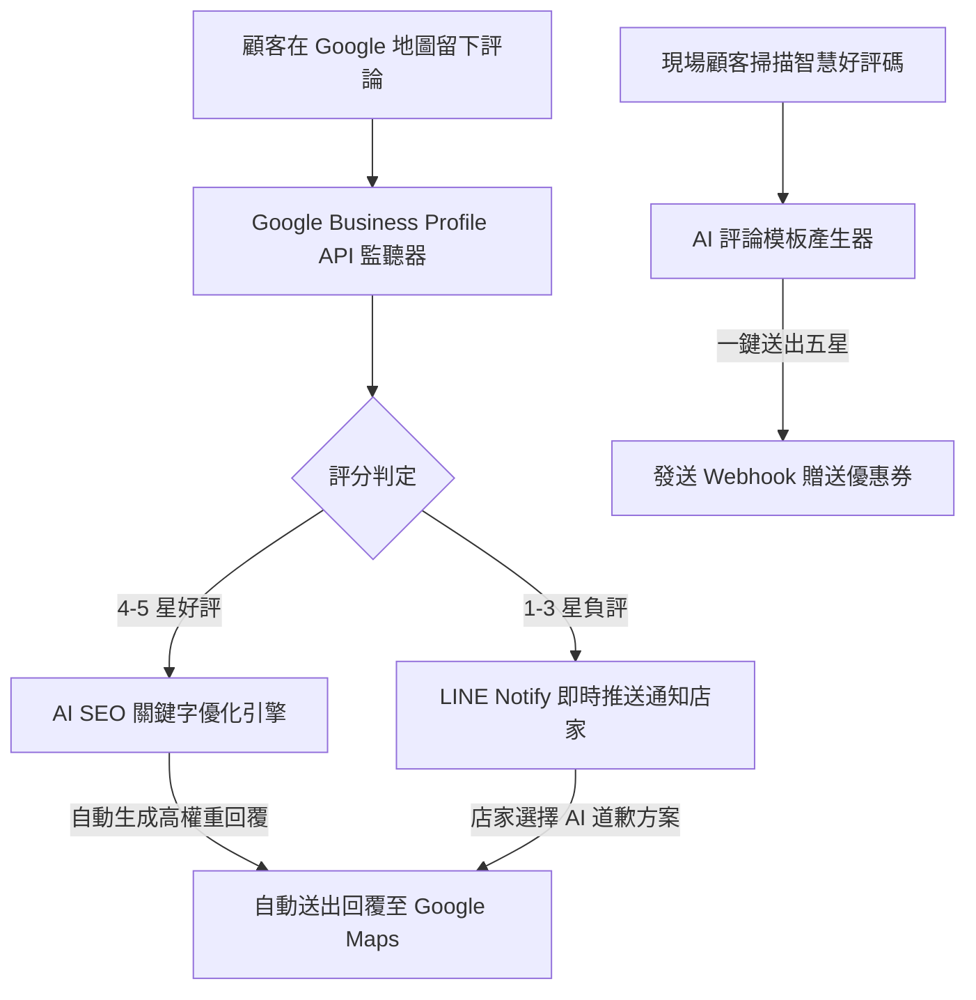

# 📈 AI 在地商家地圖優化與評論自動變現系統 (AI Local Maps Optimizer & Review Responder)
> **產品需求文檔 (PRD - Product Requirement Document)**
> **專案版本**: v1.0.0
> **開發日期**: 2026-07-16

---

## 1. 產品願景與定位 (Product Vision)

### 1.1 產品定位
本產品是一款針對**實體線下商家**（如：餐飲、美髮、診所、健身房）設計的 Google 在地地圖商家 (Google Business Profile) 優化與自動化行銷變現 SaaS 平台。
店家老闆無需親自操作繁雜的 SEO 與評論回覆，平台將透過 AI 全自動監聽地圖動態、撰寫高 SEO 權重的客製化回覆、建立負評預警公關方案、並藉由線下 QR Code 與自動簡訊系統向滿意顧客索取五星好評，直接提升店家的曝光率與來客量。

### 1.2 核心痛點
*   **沒時間經營 Google 地圖**：實體店老闆忙於現場服務，無暇每天登入回覆 Google Maps 評論。
*   **SEO 曝光權重不足**：不知道如何在回覆或商家描述中合理排佈在地關鍵字（如「台北大安區剪髮推薦」、「高CP值火鍋」），導致搜尋排名落後。
*   **一星惡意差評災難**：負評處理不及時或回覆不當，導致網路形象受損。
*   **好評索取困難**：現場結帳後，顧客常忘記留下好評，且寫好評的過程繁瑣。

---

## 2. 核心功能模組 (Core Features)

### 2.1 商家評論即時監聽與 AI 智慧回覆 (API Review Engine)
*   **Google Business Profile API 監聽**：即時獲取最新顧客星等與文字評論。
*   **SEO 關鍵字自動植入**：AI 依據店家定位與選定關鍵字，在好評回覆中「自然融入」地標與產品詞，提升地圖在地搜尋權重 (Local SEO)。
*   **情感語調適配**：根據店家風格（專業、溫馨、幽默）自動調整回覆口氣。

### 2.2 負評預警與公關風控系統 (Negative Review Alert & PR Dashboard)
*   **低星即時警報**：當收到 3 星或以下評論，系統自動發送 LINE/Telegram 通知給老闆。
*   **公關回覆生成**：AI 自動生成 3 種兼具誠意與合規的道歉補償方案供老闆選擇，確認後再行公開回覆，避免網路上直接起衝突。

### 2.3 智慧線下引流與好評索取 (Lead Magnet & Smart QR Generator)
*   **智慧好評 QR Code**：顧客掃碼後，系統會利用 AI 引導顧客，提供「好評關鍵字靈感」（例如：直接顯示「環境乾淨、服務親切、食材新鮮」，顧客點選即可自動拼成評論），大幅降低填寫門檻。
*   **自動化優惠券發放**：確認客戶成功送出評論後，系統透過 Webhook 與 API 自動發送店內電子優惠折價券（Stripe / LINE Pay 或店內 POS 系統對接）。

---

## 3. 系統技術架構與資料流 (Technical Architecture)

### 3.1 技術棧
*   **前端**：React + Vite + Tailwind CSS + Lucide Icons
*   **後端**：Node.js Express + tRPC API 伺服器
*   **資料庫**：MySQL + Drizzle ORM
*   **整合自動化**：LINE Messaging API / Google GBP API / Stripe API

---

## 4. 變現模式與定價 (Monetization Model)

### 4.1 方案設計
1.  **免費版 (Free Tier)**：
    *   可綁定 1 家門市。
    *   每月限制自動回覆 15 則好評。
    *   不支援負評 LINE 即時通知、不支援線下 QR Code 優惠發放。
2.  **專業版 (Premium Tier) - NT$ 990/月**：
    *   無限制自動評論回覆與在地 SEO 關鍵字優化。
    *   啟用 1-3 星負評 LINE/SMS 即時預警。
    *   啟用智慧線下好評 QR 碼與 Stripe / POS 金流優惠券自動發送系統。
    *   提供月度 Google 地圖排行優化成效報表。
