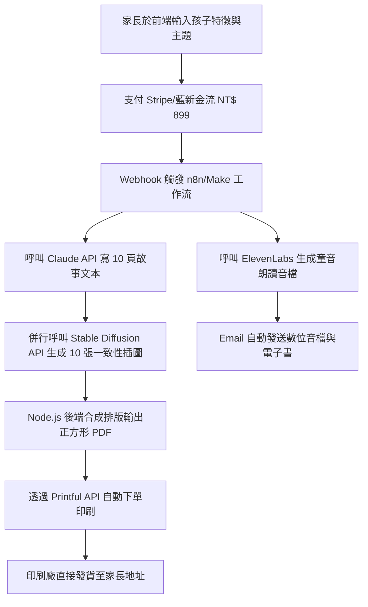

# 🧠 2026-07-04 今日商業點子：AI 客製化兒童繪本與有聲書生成平台
> **點子概念**：家長輸入孩子的名字、年齡、興趣、性格與想傳達的教育啟示（例如：分享、勇氣、保護環境），平台在 1 分鐘內自動生成個人化故事文本、精美繪本插圖與語音朗讀，並提供「數位 PDF + 音檔訂閱」或「高品質實體書（POD 自動印刷配送）」的變現服務。

---

## 📥 階段一：群雄激辯 (Brainstorming & Debate)

🚀 **火星開拓者 (Mars Pioneer)**:
> 「這是一個典型的一人公司機會。核心是**完全自動化（Zero-Human Intervention）**的管線（Pipeline）。用戶在前端輸入參數，後端 API 幾秒鐘內併行呼叫 LLM 寫故事、Stable Diffusion / Midjourney 生成插圖，同時用 ElevenLabs 克隆或生成溫暖的童音。家長付款後直接觸發 API 送到 Print-on-Demand (POD) 印刷廠。這是一部自動印鈔機，沒有庫存，只有純利潤。我們要把它做成極速版，10秒內就讓家長在網頁上看見預覽！」

🏭 **晶片教父 (Chip Godfather)**:
> 「火星開拓者太樂觀了。你忽略了**品質控制與供應鏈風險**。印刷廠的良率、紙張厚度、油墨退色和物流延遲，都是你的直接客範疇。如果 AI 生成的插圖出現畸形的六指手，或者文字排版重疊，家長收到實體書時會立刻要求退款。我們的核心護城河不能只是調用 API，而是要有『排版微調與人工檢視引擎』，甚至要在資料庫裡預先建立高品質的插圖風格模型，確保每本印刷出來的書都符合精品級標準。」

🎯 **流量狂人 (Traffic Maverick)**:
> 「你們都在糾結技術和供應鏈，但家長根本不在乎你的排版引擎是怎麼寫的！家長買的是**情緒價值（Emotional Value）**。當他們看到自己的孩子變成故事書裡拯救森林的主角，那種感動才是成交的關鍵。我們要在 Threads 和 TikTok 上大量發送短影片：『當我的五歲兒子看到自己跟恐龍一起冒險的故事書時，他高興得哭了！』不要賣紙張，要賣眼淚、賣擁抱、賣家長的優越感。免費版送 3 頁 PDF 預覽，要看結局？要實體書？付錢！」

🍎 **極簡設計家 (Minimalist Designer)**:
> 「我同意流量狂人的觀點，但如果產品視覺很差，就沒有任何情感價值可言。當前的 AI 繪本排版大多非常醜陋。我們要設計一套**極簡、經典的排版範本**，使用 Inter 或 Goudy 這種優雅的字體。AI 生成的插畫風格必須被嚴格限制在『歐洲經典水彩風』或『溫馨粉蠟筆風』，絕對不能有任何廉價的 3D 渲染感。使用者一打開網站，就必須感受到像實體精品書店一樣的視覺衝擊。」

🪶 **羽扇軍師 (Feather-Fan Strategist)**:
> 「兩軍交戰，攻心為上。家長個人訂單雖然利潤高，但獲客成本也高。我獻一策：**借力打力，攻佔幼兒園與補習班**。我們可以推出『班級繪本』或『畢業故事集』。讓老師輸入班上 20 位小朋友的名字與集體活動照片，自動生成一本以全班為主角的冒險故事書。一本訂價 NT$ 800，全班 20 位家長人手一本，獲客成本直接降為零，而且一次就是批發大單。」

---

## ⚖️ 階段二：戰略收斂與共識

結合導師激辯的觀點，我們將天時、地利、人和進行戰略收斂：

*   **天時 (趨勢)**：Midjourney V6 與 SDXL 在插圖角色一致性（Character Consistency）的控制技術已經成熟；語音合成（如 ElevenLabs / ChatTTS）的語調已能做到極具溫度的說故事效果。
*   **地利 (市場)**：客製化兒童禮品在歐美與台灣皆為高單價、高回購率的藍海市場。實體印刷成本僅約 NT$ 150 - 200，零售價可定在 NT$ 899 - 1200，毛利率高達 75% 以上。
*   **人和 (AI技術)**：使用 React 前端 + Node.js 後端，結合自動排版庫（如 Canvas/PDFKit），後端透過 Webhook 串接 Printful 或台灣本地 POD 印刷廠 API。

> 核心變現模式：
> **「免費試讀 3 頁預覽 + 數位版（PDF + 有聲書 MP3）售價 NT$ 299 + 實體精裝繪本印製寄送售價 NT$ 899」之一次性變現與月度訂閱綜合體。**

---

## 🧭 階段三：一人公司落地藍圖

### 1. 核心護城河 (The Moat)
*   **獨家插畫風格 LoRA 模型**：不使用通用繪圖 API，而是在後端使用預先微調好、具備歐洲經典繪本風格的穩定擴散模型，確保生成人物不會出現畸變，視覺風格極其一致。
*   **角色面部一致性引擎**：用戶上傳孩子正面照片，AI 自動提取特徵並融入繪本主角，達到「孩子真的進入故事中」的強烈代入感。

### 2. 流量與行銷天條 (Growth Hack)
*   **「曬娃分享」行銷**：數位版生成後，提供一鍵導出精美 30 秒「繪本朗讀翻頁影片」功能。家長分享至 Instagram Stories / Threads 即可獲得實體書 9 折優惠券。
*   **幼兒園合夥人計劃**：提供幼兒園老師免費的一鍵班級故事書生成工具，透過教師管道向家長推廣，分潤 20%。

### 3. 執行時間軸
*   **第 1 週**：完成核心 API 管線（LLM 故事 + SD 插畫 + 排版 PDFKit），上線 MVP。
*   **第 2-4 週**：串接藍親/Stripe 金流與 Printful POD 印刷 API。進行 50 筆實際印刷測試，調整紙張與色彩。
*   **第 2-3 月**：Threads 社群口碑引流，啟動幼兒園 B2B 合作。

---

## 🚀 階段四：AI Model 交付級執行指令

### 1. 給 Cursor / GitHub Copilot 的開發 Prompt
```markdown
System Prompt:
你是一個精通 React, Node.js 與 PDFKit 的資深全端工程師。
請建立一個自動化繪本排版排程系統：
1. 接收 JSON 格式的故事數據（包含 10 個頁面的 text 和對應的 imageUrl）。
2. 使用 PDFKit 建立 200x200mm 正方形的繪本 PDF。
3. 每一頁上方 70% 放置 imageUrl，下方 30% 使用優雅的 Serif 字體（如 Playfair Display）水平居中排版文字。
4. 提供自動溢出處理，確保單頁文字不超過 80 字，並留出 15mm 的印刷安全邊距（Bleed margin）。
```

### 2. 給 Midjourney 的插畫一致性提示詞模板
```markdown
Prompt Template:
A beautiful children's book illustration, watercolor style, soft pastel colors, [Kid Description, e.g., a 5-year-old boy with curly brown hair wearing a blue t-shirt], adventuring in a magical glowing forest, warm lighting, storybook style, captured in cozy details --ar 1:1 --v 6.0 --style raw
```

---

## ⚙️ 階段五：AI 行銷與全自動變現交付



### 核心自動化 Node.js 程式碼框架：
```javascript
// server/services/bookGenerator.js
import axios from 'axios';
import PDFDocument from 'pdfkit';
import fs from 'fs';

export async function generateBookPdf(storyData, outputPath) {
  const doc = new PDFDocument({ size: [567, 567], margin: 40 }); // 200x200mm approximately
  doc.pipe(fs.createWriteStream(outputPath));

  for (let i = 0; i < storyData.pages.length; i++) {
    const page = storyData.pages[i];
    
    // Download image to buffer
    const imgResponse = await axios.get(page.imageUrl, { responseType: 'arraybuffer' });
    const imgBuffer = Buffer.from(imgResponse.data);

    // Draw illustration (top 70%)
    doc.image(imgBuffer, 40, 40, { width: 487, height: 350 });

    // Draw typography text (bottom 30%)
    doc.y = 410;
    doc.fillColor('#1e293b')
       .fontSize(16)
       .font('Helvetica')
       .text(page.text, {
         align: 'center',
         width: 487
       });

    if (i < storyData.pages.length - 1) {
      doc.addPage();
    }
  }

  doc.end();
}
```
